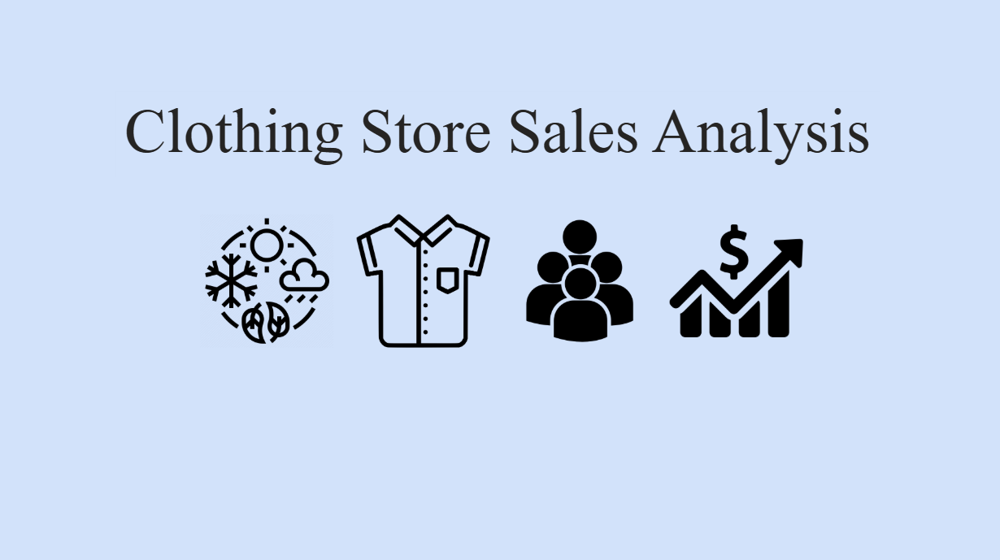
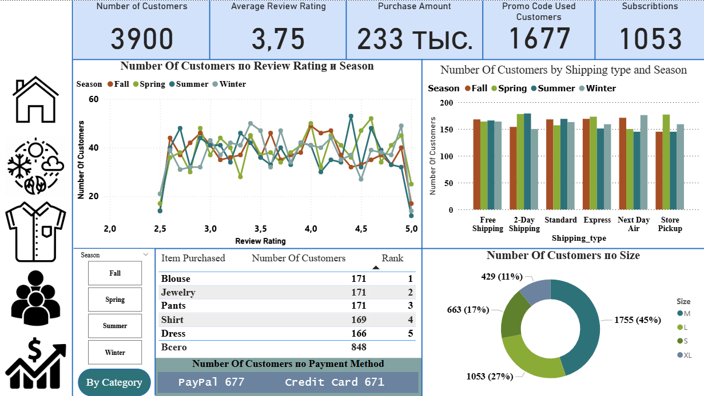
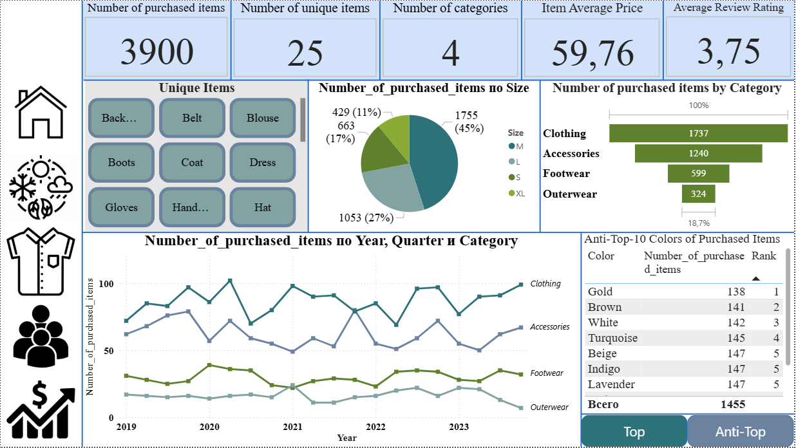
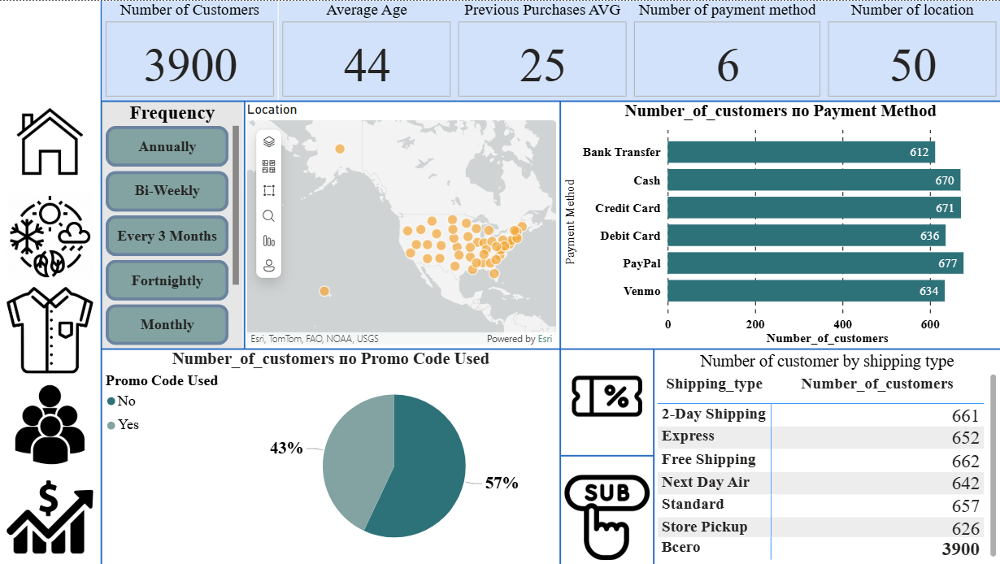
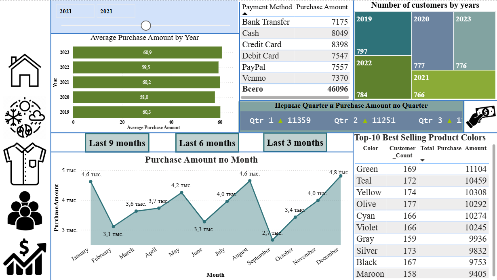

# 👗 Clothing Store Sales Analysis (Power BI Dashboard)

## 📖 Project Overview
This project presents an **interactive Power BI dashboard** analyzing shopping behavior and sales performance in a clothing store.  
The dashboard highlights **customer preferences, seasonal trends, product categories, and revenue insights**.

## 📂 Dashboard Structure
- **Home Page** – navigation page with links to the main dashboards.  
- **Seasons** – sales and shopping behavior across different seasons (spring, autumn, etc.).  
- **Purchases** – distribution by product categories and purchase frequency.  
- **Customers** – segmentation by demographics and payment methods.  
- **Revenue** – income analysis and overall sales performance.

## 🛠 Tools & Technologies
- Power BI Desktop  
- DAX (for calculated measures)  
- Data cleaning & transformation  

## 📸 Dashboard Preview
### 🏠 Home Page

### 🍂 Seasons

### 🛍 Purchases

### 👥 Customers

### 💰 Revenue

## 📁 Files
- `Shopping-Trends-Analytics.pbix` – Power BI project file  
- `README.md` – project documentation  
- `screenshots/` – dashboard images  
